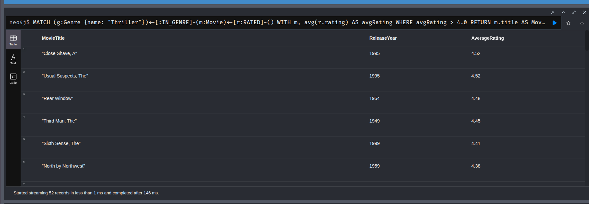
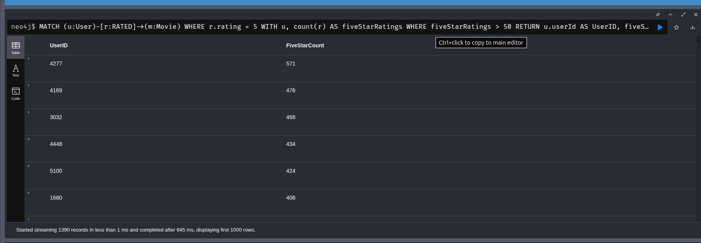
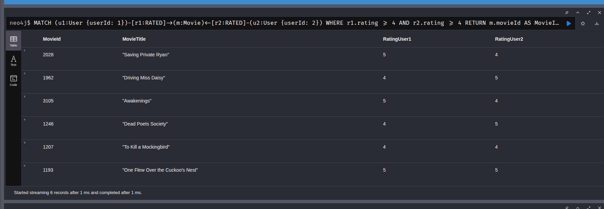
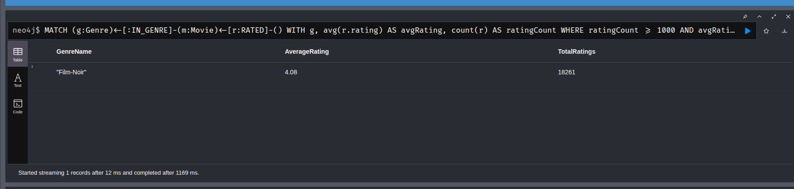
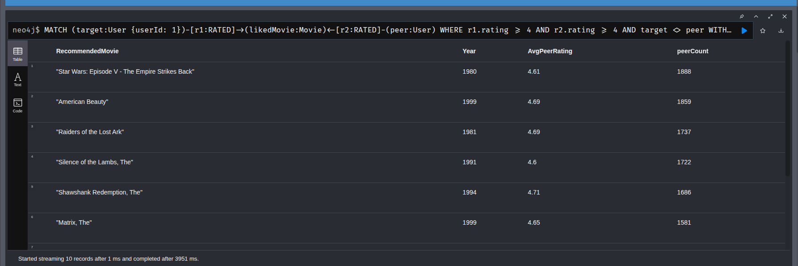
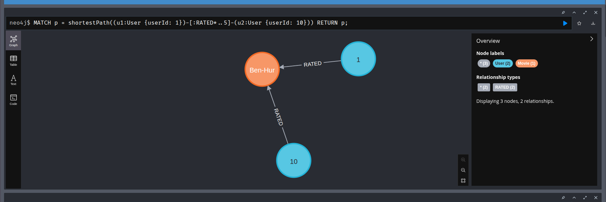
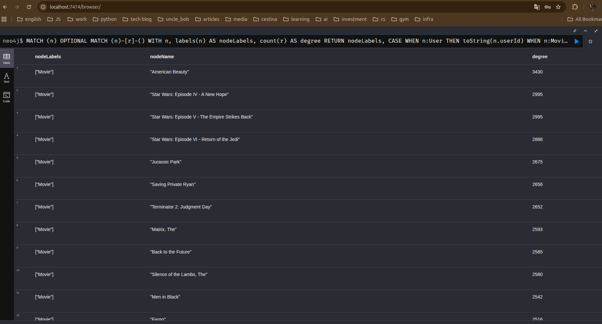
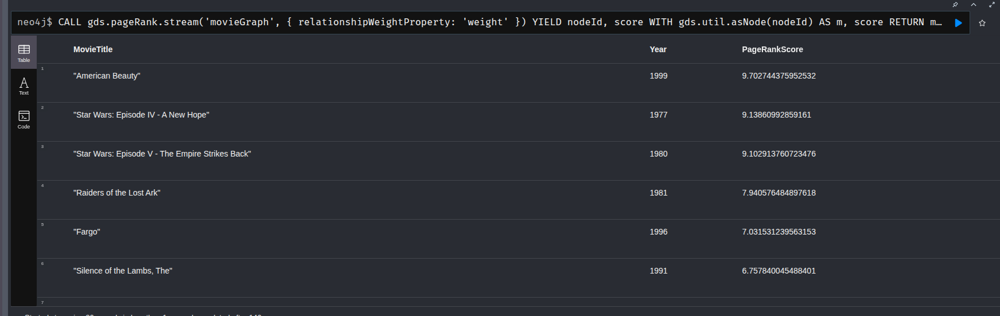

# Граф знань для рекомендаційної системи

## Відповіді на питання.

## Завдання 1

### Схема графа
```text
=========================

Nodes:
  (:User)
  (:Movie)
  (:Genre)

Relationships:
  (:User)-[:RATED]->(:Movie)
  (:Movie)-[:IN_GENRE]->(:Genre)


Graph structure:

+------------------+        RATED         +------------------+
|      User        | -------------------> |      Movie       |
+------------------+                      +------------------+
| userId           |                      | movieId          |
| gender           |                      | title            |
| age              |                      | year             |
| occupation       |                      +------------------+
+------------------+                               |
                                                   |
                                                   | IN_GENRE
                                                   v
                                         +------------------+
                                         |      Genre       |
                                         +------------------+
                                         | name             |
                                         +------------------+


Relationship properties:

(:User)-[:RATED]->(:Movie)

RATED {
  rating: Integer,      // 1..5
  timestamp: Integer,   // Unix timestamp from MovieLens
}
```
### 1. Які сутності стали вузлами, а які — ребрами? Чому?
User, Movie, Genre стали вузлами. Оцінка користувача (RATED) i приналежність фільму до певного жанру (IN_GENRE) стали ребрами. 
Дана схема продиктована запитами які будуть виконуватись над графом. Для No SQL DBMS зазвичай не нормалізують схему, а будують її таким чином, щоб оптимально
виконувати найчастіші запити які виникатимуть в додатку. Перед побудовою схеми я переглянув завдання 3, де будуються пошукові запити, і зробив мінімальну необхідну схему для таких запитів.
Якщо б у нас проводився пошук по віковим групам чи по професіям, можна було б винести їх в окремі вузли, але для нас це буде зайве ускладнення.

### 2. Оцінка користувача за фільм — це ребро (User)-[:RATED]->(Movie) чи окремий вузол (Rating)? Аргументуйте своє рішення. Це не риторичне запитання: в обох підходів є реальні trade-off-и.
У моїй схемі це ребро, тому що воно описує зв'язок користувача і фільма, має лише 2 властивості і немає власних звязків, окрім користувача і фільму. Перетворивши її на сутність, ми б просто ускладнили схему ще 2 звязками.
Проте, це не універсальний підхід, він лише актуальний для даного use case.

### 3. Чому жанри фільму вигідніше зберігати як окремі вузли (Genre), а не як список у властивості вузла Movie?
Тому що у нас є запити (частина 3, 4, 5) які будуються від жанрів. Якщо моделювати дану сутність як атрибут Movie, тоді для запитів по жанрам DB engine буде перебирати 
усі вузли movie (яких декілька тисяч), можна створити індекс, але, тоді втратится сенс графової бази даних і додатково буде необхідно зберігати даний індекс. Проте, моделювання жанру як окремого вузла
приносить свої проблеми - вузол жанру перетворюється у супервузол.

## Завдання 2

### У README поясніть кожен запит: що він робить і чому написаний саме так

#### 1. Створення індексів 
Для початку створюємо unique CONSTRAINT (який створює також індекс, окрім добавлення обмеження по унікальності ідентифікаторів). Це прискорить пошук вузлів при створенні зв’язків та запити з вказанням конкретних ідентифікторів.
Важливо створити індекси ДО завантаженя ребер, щоб імпорт ребер уже використовував індекси.
```cypher
CREATE CONSTRAINT unique_userId IF NOT EXISTS FOR (u:User) REQUIRE u.userId IS UNIQUE;
CREATE CONSTRAINT unique_movieId IF NOT EXISTS FOR (m:Movie) REQUIRE m.movieId IS UNIQUE;
CREATE CONSTRAINT unique_genreName IF NOT EXISTS FOR (g:Genre) REQUIRE g.name IS UNIQUE;
```
#### 2. Завантаження інфомації по користувачам
Завантажуємо користувачів однією транзакцією з csv файлу. Для створення використовується `MERGE`, що дозволить повторно запускати запит не створюючи дублікатів (якщо б не було індексів з кроку 1) і оновлюючи існуючі ноди
і створюючи нові, якщо їх не було (релевантно для усіх запитів у завданні 2).
```cypher
LOAD CSV WITH HEADERS FROM 'file:///users.csv' AS row
MERGE (u:User {userId: toInteger(row.userId)})
SET u.gender = row.gender,
    u.age = toInteger(row.age),
    u.occupation = toInteger(row.occupation);
```
#### 3. Завантаження інформації по фільмам
Запит складніший ніж попередній, так як у процесі імпорту, ми повинні за допомогою утиліт-функцій "витягнути" movie `title` i `year` з одного значення, 
розпарсити жанри, і створити окремо ноди також для жанрів і одразу створити зв'язок між фільмом і жанром.
```cypher
LOAD CSV WITH HEADERS FROM 'file:///movies.csv' AS row
MERGE (m:Movie {movieId: toInteger(row.movieId)})
SET 
  // Витягуємо рік за допомогою регулярного виразу (шукаємо 4 цифри в дужках в кінці рядка)
  m.year = toInteger(apoc.text.regexGroups(row.title, '\((\d{4})\)$')[0][1]),
  // Очищаємо назву фільму від року та зайвих пробілів в кінці
  m.title = trim(replace(row.title, apoc.text.regexGroups(row.title, '\((\d{4})\)$')[0][0], ""))
WITH m, row
UNWIND split(row.genres, "|") AS genreName
MERGE (g:Genre {name: genreName})
MERGE (m)-[:IN_GENRE]->(g);
```
#### 4. Імпортування рейтингу.
Рейтинг представлений звязком `RATED` між користувачем та фільмом. Так як рейтингів більше 1 млн рекомендовано розбивати такий імпорт на батчі, які виконуватимуться 
окремими транзакціями, а не в одній великій транзакції. Транзакції розбиваюься на пачки по 50 000 і виконуються послідовно.
```cypher
CALL apoc.periodic.iterate(
  // перший запит — генерує потік елементів
  "LOAD CSV WITH HEADERS FROM 'file:///ratings.csv' AS row RETURN row",
  
  // другий запит — застосовується до кожного елемента
  "MATCH (u:User {userId: toInteger(row.userId)})
   MATCH (m:Movie {movieId: toInteger(row.movieId)})
   MERGE (u)-[r:RATED]->(m)
   SET r.rating = toInteger(row.rating),
       r.timestamp = toInteger(row.timestamp)",
       
  // Параметри конфігурації
  {batchSize: 50000,   parallel: false}
)
YIELD batches, total, errorMessages
RETURN batches, total, errorMessages;
```

## Завдання 3

### У README поясніть кожен запит: що він робить і чому написаний саме так.

#### Запит 1. Знайти всі фільми жанру «Thriller» із середнім рейтингом вище 4.0:

Спочатку знаходимо вузол жанру Thriller, бо жанри у схемі винесені окремими нодами. Далі через зв'язок `IN_GENRE`
беремо всі фільми цього жанру. Після цього по зв'язках `RATED` збираємо оцінки цих фільмів і через `avg` рахуємо
середній рейтинг для кожного фільму.
`WITH` тут потрібен, бо спочатку треба порахувати агрегатне значення, а вже потім відфільтрувати результат по `avgRating > 4.0`.



#### Запит 2. Знайти користувачів, які поставили оцінку 5 більш ніж 50 фільмам

Тут ми дивимось тільки на зв'язки `RATED`, де `rating = 5`, тобто користувач поставив максимальну оцінку.
Потім групуємо по користувачу і рахуємо скільки таких оцінок він поставив.
Фільтр `count > 50` потрібен, щоб знайти не просто випадкового користувача з кількома п'ятірками, а тих, хто реально часто ставив 5.



####  Запит 3. Знайти фільми, які обидва користувачі (наприклад, userId=1 і userId=2) оцінили високо (рейтинг ≥ 4):

У цьому запиті шукаємо перетин між двома користувачами. Тобто є один і той самий вузол `Movie`, до якого
йдуть `RATED` зв'язки від userId=1 і userId=2.
Умова `rating >= 4` стоїть для обох зв'язків, бо нам треба не просто спільно переглянуті фільми, а саме ті, які обом сподобались.



#### Запит 4. Знайти жанри, чиї фільми стабільно отримують високі оцінки — середній рейтинг і кількість оцінок:

Запит іде від жанрів до фільмів, а потім до оцінок. Для кожного жанру збираються всі рейтинги фільмів, які мають
зв'язок `IN_GENRE` з цим жанром. Далі рахується середня оцінка і кількість оцінок.
Я додав умову `ratingsCount >= 1000`, бо без неї можуть вилізти жанри, де оцінок дуже мало і середнє значення буде не дуже показове.
Після цього вже залишаються жанри, де середній рейтинг більший або рівний 4.0.



#### Запит 5. Рекомендація «користувачі зі схожими смаками також дивилися»: для заданого користувача знайти фільми, які він ще не дивився, але високо оцінили користувачі з подібними смаками:

Якщо інші користувачі високо оцінили ті самі фільми, що і наш користувач, то їхні інші улюблені фільми теж можуть бути нормальними рекомендаціями.

Спочатку шукаються користувачі, які мають спільні високо оцінені фільми із заданим користувачем. Високою оцінкою я тут вважаю
`rating >= 4`. Потім для цих схожих користувачів шукаються інші фільми з високою оцінкою, але обов'язково перевіряється,
що початковий користувач їх ще не оцінював. 

Сортування робиться по кількості схожих користувачів і середньому рейтингу, бо фільм, який радять багато схожих користувачів,
виглядає надійніше ніж фільм від одного користувача.



#### Запит 6. Знайти найкоротший ланцюжок зв’язку між двома користувачами через спільні фільми:

Цей запит шукає найкоротший шлях між двома користувачами через `RATED`. У нашій схемі користувачі напряму не з'єднані
між собою, тому шлях завжди проходить через фільми.

Це означає, що два користувачі оцінювали один і той самий фільм, тобто між ними є зв'язок через спільний перегляд.

Обмеження `*..5` я ставлю, щоб Neo4j не шукав занадто довгі ланцюжки. Для такого завдання достатньо подивитись короткі зв'язки,
бо дуже довгий шлях вже майже нічого не говорить про схожість користувачів.



### Що означає довжина шляху в даному контексті?

Довжина шляху в Neo4j це кількість зв'язків, які треба пройти від одного вузла до іншого.
У цьому графі шлях чергується між користувачами і фільмами, бо користувач має зв'язок тільки з фільмом через `RATED`.
Тобто шлях виглядає приблизно так: `User -> Movie -> User -> Movie...`

### Як інтерпретувати шлях довжини 4? Довжини 6?

Шлях довжини 4 (Користувач А — Фільм 1 — Користувач Б — Фільм 2 — Користувач В)
Користувач А і Користувач В можуть не мати спільного фільму напряму. Але Користувач А має спільний фільм з Користувачем Б,
а Користувач Б має інший спільний фільм з Користувачем В. Тобто це вже зв'язок через одного проміжного користувача.

Шлях довжини 6 (Користувач А — Фільм 1 — Користувач Б — Фільм 2 — Користувач В — Фільм 3 — Користувач Г)
Тут зв'язок ще слабший, бо між початковим і кінцевим користувачем вже два проміжні користувачі і три фільми.
Такий шлях більше показує загальну зв'язаність графа, а не прямий збіг смаків. Тому коротші шляхи для рекомендацій або аналізу схожості зазвичай корисніші.

## Завдання 4. 

### 1. Які вузли виявилися супервузлами? Скільки у них зв’язків?



За результатами запиту найбільше зв'язків мають популярні фільми. У топ-5 кількість зв'язків приблизно від 2675 до 3430.
Це логічно для цього датасету, бо фільмів не так багато, приблизно 3.5 тисячі, а рейтингів більше мільйона.
Тому багато користувачів оцінювали одні й ті самі популярні фільми.

Жанри також можуть бути супервузлами, але в цьому датасеті фільми вийшли більш помітними, бо саме до них напряму йде дуже багато `RATED` зв'язків.
Якби фільмів було значно більше, тоді популярні жанри швидше за все, стали б основними супервузлами.

### 2. Чому запит, що зачіпає такий вузол, працює повільніше, ніж запит по «звичайному» вузлу з тими самими індексами?

Індекс допомагає швидко знайти сам вузол, наприклад фільм по `movieId` або назві (якби був відповіний індекс). Але після цього Neo4j все одно має пройти по його зв'язках.
Тобто проблема не в пошуку вузла, а в тому, що біля супервузла дуже багато ребер.

Наприклад, якщо запит знаходить популярний фільм, то сам вузол можна знайти швидко. Але якщо в нього більше 3000 зв'язків `RATED`,
то Neo4j має переглянути ці зв'язки, щоб піти далі або відфільтрувати результат. На звичайному вузлі таких зв'язків може бути мало,
тому обхід буде значно дешевший.

Особливо це погано для пошуку шляхів. Якщо алгоритм потрапляє у вузол з тисячами зв'язків, то кількість можливих варіантів для наступного кроку різко збільшується.
Через це запит починає споживати більше CPU і пам'яті, навіть якщо індекси налаштовані правильно.

### 3. Яку конкретну стратегію з лекцій ви б застосували для цього датасету? (Підказка: подивіться на жанрові вузли — вони теж супервузли?) Що з ними робити?

Для цього датасету я б застосував дві стратегії.

Перша стратегія це розбиття супервузлів на менші вузли. Для жанрів це досить природно, бо один вузол `Genre {name: "Drama"}`
може мати дуже багато фільмів. Його можна розбити, наприклад, по десятиліттях: `Drama_1990s`, `Drama_2000s`, `Drama_2010s`.
Тоді замість одного великого жанрового вузла буде кілька менших, і запити не будуть постійно проходити через один супервузол.

Для фільмів можна робити схожу ідею не з самим фільмом, а з рейтингами. Наприклад, якщо аналізуються рейтинги по часу,
можна додавати часову ознаку або окремі агреговані вузли/зв'язки для періодів. Так не потрібно кожен раз обходити всі оцінки популярного фільму.

Друга стратегія це фільтрувати перед обходом. У рекомендаційних запитах краще не пускати алгоритм через занадто популярні вузли,
бо вони дають багато слабких зв'язків і погіршують продуктивність. Наприклад, можна не брати фільми, у яких занадто багато оцінок,
або обмежувати пошук тільки потрібними типами зв'язків. Для найкоротших шляхів я б не використовував `IN_GENRE`, бо жанри швидко перетворюють пошук
на дуже широкий обхід графа.


## Завдання 5

### 1. Що означає високий PageRank для фільму в цьому графі? Це просто “популярний фільм” чи щось інше?


Високий PageRank тут означає не просто те, що фільм багато разів оцінили. Він показує, що фільм знаходиться в центрі
мережі схожих фільмів.

У цьому графі два фільми пов'язані тоді, коли їх високо оцінили одні й ті самі користувачі. Тому фільм з високим PageRank
має зв'язки не тільки з великою кількістю фільмів, а ще й з такими фільмами, які самі є важливими в графі.

Тобто популярність це просто багато оцінок, а PageRank більше показує, наскільки фільм важливий у структурі спільних смаків користувачів.



### 2. Виявлення спільнот (Louvain)

#### Висновки

Результат виявлення спільнот:


Топ 10 спільнот:


Топ жанрів:


По результату видно, що спільноти вийшли не дуже чіткими. Модульність дорівнює 0.159, а це означає, що граф більше схожий
на одну змішану структуру, ніж на кілька добре відокремлених груп.

Основна активна аудиторія потрапила у три великі кластери: 793, 237 та 189 користувачів. Інші кластери в основному дуже малі.
Є багато кластерів розміром 1, тобто окремих користувачів, які не приєдналися до великих груп у побудованій проєкції.

По жанрах видно, що великі кластери не дуже відрізняються між собою. У них всюди домінують Drama і Comedy. Тобто алгоритм
не виділив окремо, наприклад, чистих любителів бойовиків чи артхаусу. Він більше відділив масову аудиторію від користувачів
з більш нетиповими смаками.

Мій висновок: Louvain знайшов кілька великих груп, але вони все одно залишились змішаними. Щоб отримати кращу сегментацію,
треба жорсткіше будувати ребра схожості між користувачами або фільмами.

#### 1. Чи відповідають отримані кластери інтуїтивним групам (наприклад, «любителі бойовиків», «цінителі арт-хаусу»)?

Не повністю. Найбільші кластери не стали чистими групами типу "любителі бойовиків" або "цінителі арт-хаусу".
У них дуже схожий жанровий склад, бо всюди зверху Drama і Comedy.

Тобто алгоритм згрупував користувачів не по простій назві жанру, а по схожості конкретних фільмів, які вони оцінювали.
Через це великі кластери вийшли досить мейнстрімними і змішаними.

#### 2. Як ви це перевірили?

Я вивів топ жанрів для найбільших кластерів і порівняв їх між собою. Якщо б кластери були інтуїтивно різними,
то в одному кластері, наприклад, домінував би Action, в іншому Romance, в іншому Sci-Fi.

Але у великих кластерах топи майже однакові, переважно Drama і Comedy. Це показує, що чіткого жанрового поділу там немає.
Малі кластери виглядають більш специфічними, але вони занадто маленькі, тому по них важко робити загальний висновок.

### Найкоротший шлях між користувачами

Між користувачами з різних ізольованих кластерів, де немає шляху:


Між користувачами де є шлях:


#### 1. Наскільки «тісний світ» у цьому датасеті? Спробуйте кілька пар користувачів.

Результат залежить від того, яких користувачів обрати. Якщо взяти двох користувачів з різних маленьких ізольованих кластерів,
то шлях між ними може взагалі не знайтись. Це означає, що побудований граф не є повністю зв'язним.

Але якщо обидва користувачі знаходяться в одному з великих кластерів, то шлях зазвичай короткий. У такій частині графа світ справді
"тісний", бо користувачі пов'язані через спільні популярні фільми або через дуже малу кількість проміжних вузлів.

Тому для всього датасету не можна сказати, що всі користувачі близько один до одного. Є велика зв'язна частина, але є і багато ізольованих або майже ізольованих користувачів.

#### 2. Яка середня довжина шляху? Чи підтверджується гіпотеза «шести рукостискань»?

Для пар користувачів, між якими шлях існує, він зазвичай короткий: приблизно 2-4 кроки. Це пояснюється тим, що багато користувачів
оцінювали одні й ті самі популярні фільми, тому між ними швидко знаходиться зв'язок.

Гіпотеза "шести рукостискань" частково підтверджується. Усередині великого зв'язного компонента користувачі справді знаходяться
один від одного ближче ніж за 6 кроків.

Але для всього графа це не працює, бо є багато ізольованих кластерів. Якщо між двома користувачами взагалі немає шляху,
то говорити про 6 кроків вже не можна. Тому висновок такий: у великій активній частині граф тісний, але глобально він фрагментований.
